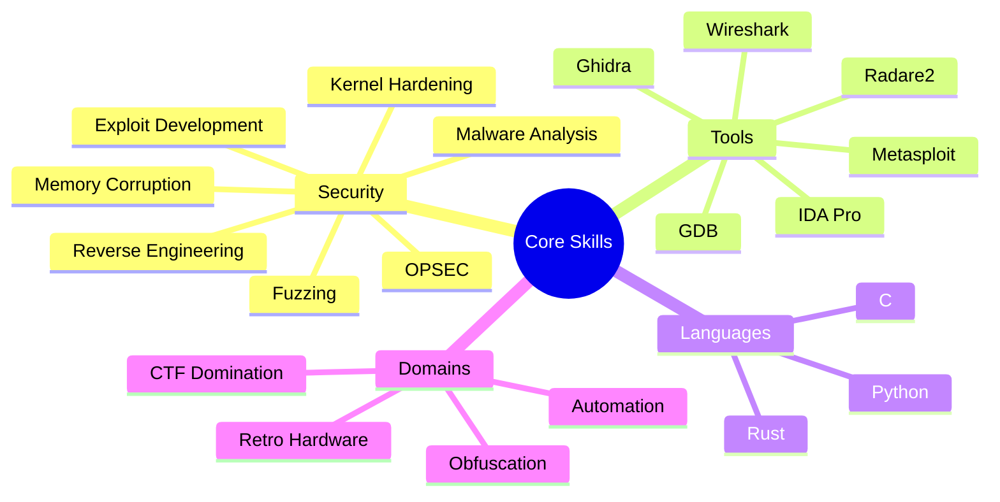

<h1 align="center">M3mC0rrupt ⚡💾</h1>

  <strong>Security Researcher | Code Corruptor | System Annihilator</strong>

  I haunt the depths of memory, corrupting systems to forge unbreakable defenses. A low-level sorcerer weaving chaos into security.

  
  

---

## 📊 Cyber Metrics

<table>
  <tr>
    <td>
      
    </td>
    <td>
      
    </td>
  </tr>
  <tr>
    <td>
      
    </td>
    <td>
      
    </td>
  </tr>
</table>

---

## 🛠️ Arsenal of Chaos

   
   
  

- **Languages**: C, Python, Rust  
- **Tools**: GDB, IDA Pro, Wireshark, Metasploit, Ghidra, Radare2  
- **Domains**: Reverse engineering, exploit development, kernel hardening, memory corruption  
- **Mindset**: Break it, understand it, secure it—repeat.

---

## 🗺️ Expertise Mindmap

Click to expand expertise

---

## 🕹️ Digital Underworld

- **Fuzzing Nightmares**: Building custom fuzzers to unearth zero-days in forgotten software.  
- **CTF Domination**: Pwn challenges bow to me—stack overflows are my warmup.  
- **Retro Hardware Necromancy**: Resurrecting ancient CPUs to exploit their deepest secrets.  
- **Obfuscation Sorcery**: Writing code that’s a labyrinth to humans but poetry to machines.  
- **Malware Dissection**: Slicing through malicious binaries in air-gapped VMs—pure adrenaline.  
- **Exploit Artistry**: Crafting payloads that slip through defenses like a whisper.

---

## ⚡ Chaos Visualization

  

  

---

## 🏆 Cyber Achievements

  

  
  

---

## 🌌 Aesthetic Vibes

  

