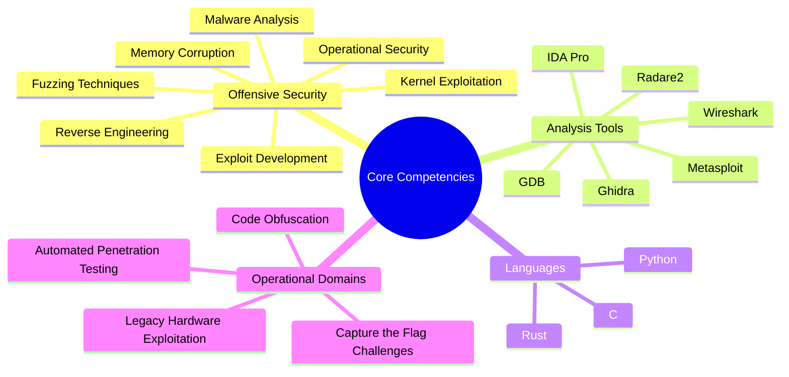

# M3mC0rrupt

**Offensive Security Specialist | Exploit Architect | Vulnerability Hunter**

Delving into the core of systems to expose and exploit weaknesses, transforming chaos into fortified defenses. A master of low-level manipulation in the realm of black hat methodologies.

---
## Performance Metrics

<table>
  <tr>
    <td>
      
    </td>
    <td>
      
    </td>
  </tr>
  <tr>
    <td>
      
    </td>
    <td>
      
    </td>
  </tr>
</table>

---
## Operational Toolkit

  
  
  

- **Programming Languages**: C, Python, Rust
- **Analysis Tools**: GDB, IDA Pro, Wireshark, Metasploit, Ghidra, Radare2
- **Specializations**: Reverse engineering, exploit development, kernel exploitation, memory corruption vulnerabilities
- **Approach**: Deconstruct, analyze, reinforce—iterative offensive refinement.
---
## Expertise Framework

Expand to view expertise structure

---
## Operational Domains
- **Advanced Fuzzing Operations**: Designing bespoke fuzzers to identify zero-day vulnerabilities in legacy and proprietary software.
- **Capture the Flag Mastery**: Dominating pwn challenges, with stack overflows serving as foundational exercises.
- **Legacy Hardware Exploitation**: Reviving obsolete processors to uncover and leverage inherent architectural flaws.
- **Code Obfuscation Techniques**: Developing intricate code structures that evade human analysis while maintaining machine efficiency.
- **Malware Reverse Engineering**: Dissecting malicious executables within isolated environments for in-depth behavioral insights.
- **Payload Engineering**: Constructing precision exploits that bypass security measures with minimal detection.
---
## Activity Visualization

  

  

---
## Professional Milestones

  

  
  

